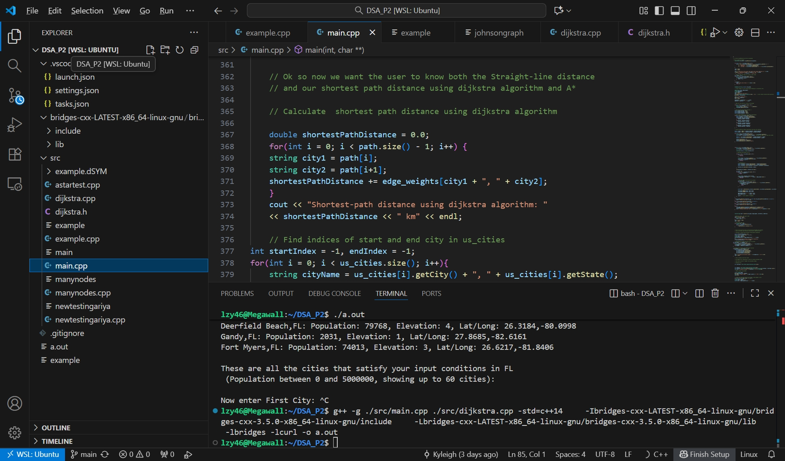

## UF DSA Project 2: US City Graphs

This is Project 2 for Data Structures and Algorithms at UF.

## 🧰 Project Description

### 📄 Description of Data
- The project uses **U.S. city data** (latitude, longitude, and population) provided by the **BRIDGES Data API**.
- Each city is represented as a **node** in a graph.
- Connections (edges) between cities represent possible routes, weighted by **geographical distance**.

---

### 🧠 Tools / Languages / APIs / Libraries Used
- **Language:** C++ (C++14 standard)
- **Development Environment:** Visual Studio Code (with WSL/Ubuntu)
- **Compiler:** `g++`
- **API:** [BRIDGES C++ API](http://bridgesuncc.github.io/) — for data visualization and U.S. city dataset access
- **Libraries Used:**
  - `<map>`, `<vector>`, `<queue>`, `<cmath>`, `<algorithm>` — for data management and computation
  - **BRIDGES** — to visualize graphs interactively
  - **STL Priority Queue** — to efficiently select the next city in Dijkstra’s algorithm

---

### ⚙️ Algorithms Implemented
- **Dijkstra’s Algorithm** — finds the shortest path between cities in a weighted graph.
- **A\* (A-Star) Algorithm** — optimized version of Dijkstra using heuristics (geographical distance).
- Both algorithms are implemented and compared for **runtime efficiency** and **memory usage**.

---

### 🧩 Additional Data Structures / Algorithms Used
- **Adjacency List:** stores city-to-city connections and their distances efficiently.
- **Priority Queue (Min-Heap):** selects the city with the smallest tentative distance in `O(log V)` time.
- **Map / Unordered Map:** tracks distances (`dist`) and predecessors (`prev`) for path reconstruction.
- **Vector:** stores and returns the final shortest path sequence.
- **Haversine Formula:** calculates real-world distance between two cities based on latitude and longitude.

---

## 🚀Features
- User selects a state, population range, number of cities, and neighbors per city.
- Graph visualization using [Bridges C++ API](http://bridgesuncc.github.io/).
- Calculates:
  - Shortest path distance (Dijkstra)
  - Shortest path distance (A*)

- Displays runtime and memory usage of both algorithms.

## 🧰 Prerequisites/Requirements

Before running this project, make sure you have:

- VS Code with WSL Extension
  - Make sure it's installed on Windows
- Ubuntu (via WSL)
- g++ compiler with C++14 support
  - Check version with `g++ --version`
- Bridges C++ library installed
  - Follow the tutorial [here](https://bridgesuncc.github.io/), dowload [Linux] [TGZ] under C++ client

  
## ⚙️Step-By-Step Usage

1. In order to compile the project, you would need to setup and run BRIDGES Programs.
2. Follow the bridges setup tutorials: [BRIDGES:Getting Started](https://bridgesuncc.github.io/bridges_setup.html)
3. Since this project is programmed in C++ by VS Code, you should follow the instruction here: [BRIDGES(C++) With VS Code:Getting Started](https://bridgesuncc.github.io/bridges_setup_cxx_vscode.html)
4. Several things the user should be careful while going through the tutorial:
   - Make sure you have the WSL Extension installed in VS Code.
   - In your task.json file, make sure to change the compiler from clang++ to g++.
   - Follow the tutorial steps carefully to avoid path or linking issues (remember
   - "-I../bridges-cxx-LATEST-x86_64-linux-gnu/bridges-cxx-3.5.0-x86_64-linux-gnu/include" should be the relative path of include folder
   - "-L../bridges-cxx-LATEST-x86_64-linux-gnu/bridges-cxx-3.5.0-x86_64-linux-gnu/lib" should be the relative path of library folder
   - Remember you are editing the program in Ubuntu linux system, not your local Windows path.
5. Below is a example screenshot of what the project should look like: 

6. Now compile it by using g++ command:

## 💡Input prompts:
- State abbreviation (case-insensitive, e.g., fl, Fl, FL)
- Minimum and maximum population
- Number of cities (1–500)
- Maximum neighboring cities per city (0–10)
- Start and end city for shortest path calculation
  - User can type the city name (case-insensitive)
  - Must exist in the selected state
 
## 🧩 Example

For a sample input/output demonstration, see:  
👉 [Example Input/Output](example.md)

## 🔍 Algorithm Documentation

For a detailed explanation of how the **Dijkstra’s Algorithm** works in this project, including its logic, data structures, and code breakdown, see:

👉 [Dijkstra Algorithm Explanation](dijkstra_walkthrough.md)

